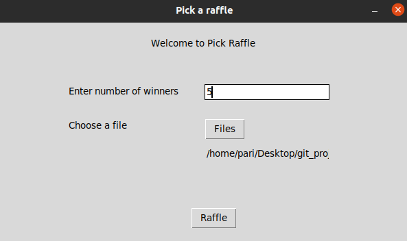
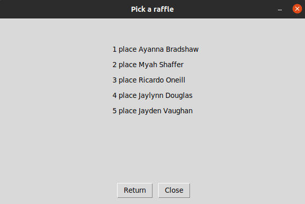

#project to pick n names from a list in excel file or csv
#use thinker

#one method to select a winner could be
-know how long does the list is,
then go to a random function and put the parameters
-other read the file and stop in the n line f the winner
this could let to work with large files
also when the user select a n winners we can get the information through readlines(line by line)

How does it works?
use a virtualenvironment to run the program
-python pick_raffle_gui.py
- complete the field with a valid data, a valid number up to ten.
-select a file with the names in column and with a title(name of the column)
-clic on "raffle"
-then you can finish or retry

